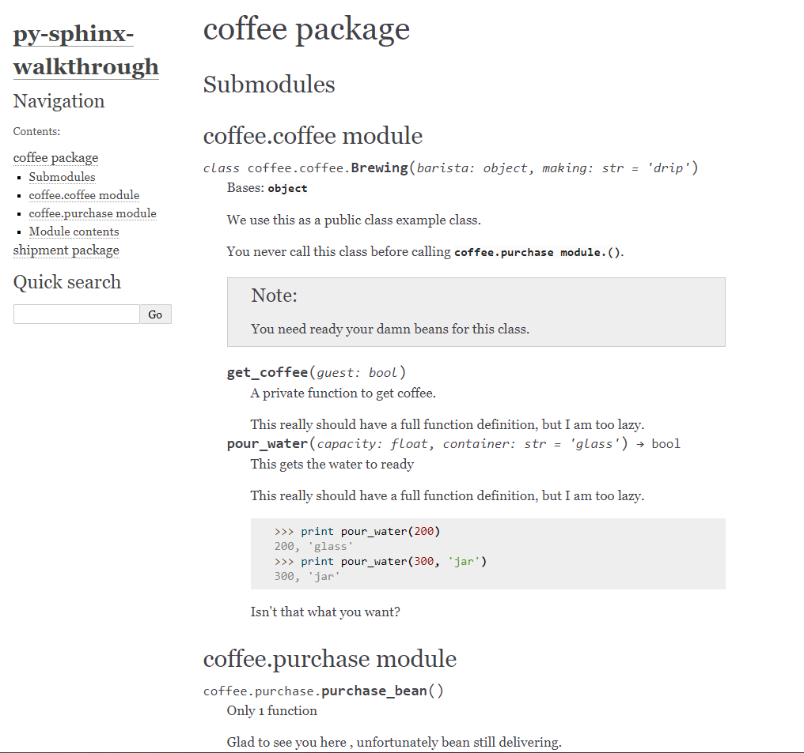

`INTRO`
1. Apply canonical approach to isolate project in src dir and docs dir

`SETUP`
1. pip install virtualenv
2. virtualenv venv
    ### window
3. source venv/Scripts/activate 
    ### linux / mac
3. source venv/bin/activate
4. pip install -r requirements.txt

`Usage`
### build .html
1. sphinx-build -b html ~/py-sphinx/docs/source docs/builddir

### build .srt
2. sphinx-apidoc -o docs/source ~/py-sphinx/src

### Scripts for 1. and 2.
3. ./build.sh

`Reference`
1. https://www.sphinx-doc.org/en/master/index.html

`Output`
